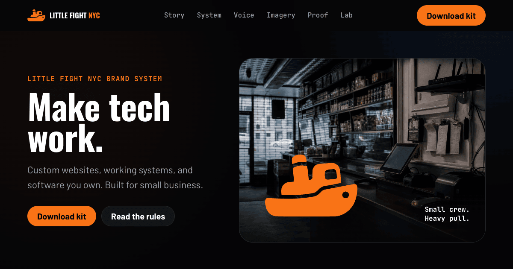

  

# Little Fight NYC

Tools the chains use, sized for the corner shop.

Custom websites. IT support. Software you own. Built for NYC small business.

- **Website:** [littlefightnyc.com](https://littlefightnyc.com)
- **Free first look:** [Tech Audit](https://littlefightnyc.com/tech-audit/)
- **Call or text:** [(646) 360-0318](tel:+16463600318)
- **Email:** [hello@littlefightnyc.com](mailto:hello@littlefightnyc.com)
- **Hours:** 9am–9pm Eastern, every day

## What this repository contains

This is the production source for the Little Fight NYC website.

- React and Vite application in `app/`
- Public Brand Kit v2.0 in `app/public/brand-kit/`
- Netlify functions in `netlify/functions/`
- Deployment configuration in `netlify.toml`
- Quality and release checks in `.lifi/`

The production branch is `main`. Netlify builds the live site from this repository.

## Content-source architecture (crawler view vs hydrated view)

Every route ships twice from one contract: `app/scripts/prerender-seo.mjs` writes the static
`lf-seo` shell crawlers and no-JS visitors receive, and the React tree renders the same route
after hydration. Both are generated from the same data modules (`app/src/data/seo-pages.json` →
`route-meta.json`), and divergence is a build failure, not a risk to watch:
`audit-metadata-parity` diffs the prerendered dist H1/title/meta against the contract, and
`tests/quality-smoke.spec.ts` asserts the hydrated H1s against the same data. Change copy in the
data modules (see HANDOFF notes for the H1's six pinned locations), never in one render path alone.

## Working on the site

Read [`AGENTS.md`](./AGENTS.md) before making changes. It defines the source boundaries, validation steps, and deployment rules.

The concise deployment map is in [`SOURCE_OF_TRUTH.md`](./SOURCE_OF_TRUTH.md).

## Why Little Fight exists

NYC small businesses should not need chain-sized budgets for good technology.

We build what earns its keep. If we cannot help, we say so.
